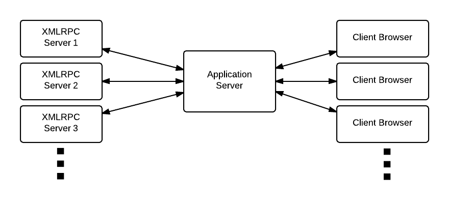
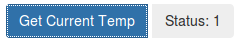
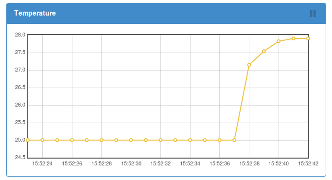
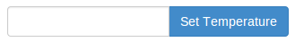
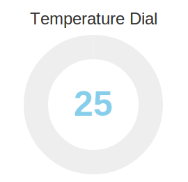

# OpenLabTools Web interface

## Introduction
The web interface is a set of software to enable simple controls of hardware using a browser. Having a web interface means that hardware can be monitored and controlled from anywhere using anydevice with a modern broswer.

The OpenLabTools Web interface features:

* __Control widgets__: buttons, sliders, toggles and more
* __Monitor widgets__: Time series plots, dynamic texts, video streams and more
* __Data explorer__ (in development)

The code is done entirely using python, html and javascript hence it is compatable with virtually any platform, be it Windows, mac or linux.

Screenshot:

## The basics

### Software structure

#### Device class
This is a user defined class to impliment methods to communicate with the hardware. Users will be able to call these functions in order to control and monitor the target hardware.

#### XMLRPC server
A simple XMLRPC server is implimented using python's xmlrpclib module. The server will expose methods from a user defined class named Device as functions. The application server can call these functions and get the returned data.

* [xmlrpclib python doc](https://docs.python.org/2/library/xmlrpclib.html)
* [XML-RPC wikipedia](http://en.wikipedia.org/wiki/XML-RPC)

#### Application server
This server is implimented using python's flask library. It serves a dynamically generated webpage to clients web browser. And it will serve requests from the UI elements and translate them into xmlrpc calls.

* [Flask official webpage](http://flask.pocoo.org/)

### The basic setup
* The software is written in python hence it can be run on any python enabled platform.
* The xmlrpc server and application server can be run on the same device or different devices in the same network.

Here we will describ a set up with a raspberry Pi commanding the OpenLabTools microscope through an Arduino and a desktop running the application server.

#### Raspberry Pi
a xmlrpc server will run on the raspberry pi.

Files needed:

__PiServer.py__ : Download archive of OpenLabTool-web-interface git repository, extract and transfer this file onto the Pi. Alternatively run this command on the Pi: `wget https://raw.githubusercontent.com/OpenLabTools/OpenLabTools-web-interface/master/code/PiServer.py`

__Device Class Definition File__: This file is written by the user and will define a Class named __Device__. Methods of this class are functions which can be mapped to the UI. For example Device.led_on() can be mapped to a UI button to turn on an LED.

Usage:

    python PiServer.py [Device Class Definition File] [port no]

#### Desktop PC
The desktop PC will run the application server which will:

* Serve the static webpages and related files.
* Serve fucntion calls from the UI and relay the calls to the xmlrpc server.

__Prerequistes:__

Python modules: Flask, Flask-cache plugin, pylibmc and configobj

The easiest way to install these is through python-setuptools and pip.
To install these tools on ubuntu run the following commands:

    # install easy_install
    sudo apt-get install python-setuptools

    # install pip
    easy_install pip

    # install configobj
    easy_install configobj

    # install flask
    pip install Flask

    # install pylibmc
    sudo apt-get install -y libmemcached-dev zlib1g-dev libssl-dev python-dev build-essential
    pip install pylibmc

__Program Files and Configuration:__

* Clone the OpenLabTools-web-interface repository: `https://github.com/OpenLabTools/OpenLabTools-web-interface.git`
* A UI configuration file: For each raspberry pi, Will define the UI elements and the xmlrpc functions that are mapped to these elements. [#Guide to writing the user defined files]
* A cluster configuration file: Will define the UI config filename and xmlrpc server address for each raspberry pi connected to this application server.[#Guide to writing the user defined files]

Usage:

    sudo python OLTwi_server.py [cluster config filename]

This will start a server on port 80 which then can be access via any web browser in the same network. Point your browser at the ip address of the server and a webpage will show up asking you to pick a device.

#### Run examples

If you want to see an example web interface, run the following command.

    sudo python OLTwi_server.py

    # open another terminal and run
    python PiServer.py test

Point your browser to "localhost" and select "Overview of all widgets" at the bottom of the page. The web interface is rendered according to the config file: `examples/OLT_cluster_config.ini` and the "Overview of all widgets" UI is defined by `examples/WidgetOverview/UI_config`. The "Device" class is defined in `examples/WidgetOverview/Microscope_dummy.py`.

---

## Guide to writing the user defined files

### UI configuration file

This file defines the user interface for each raspberry pi connected to the application server. To dive in, here is an example of the file:

    [Controls]
        id = eccfe629
        [[UP]]
            type = button
            func = motion_control
            args = up
            id = ec9bcf8f

    [Monitor]
        id = a3fa5e11
        [[Current Temperature]]
            type = text
            func = get_temp
            refresh interval = 1
            id = 58b2c397

[Monitor] and [Controls] well be rendered as two Sections in the UI. They are purely there to visually contain the UI. You should always have at least one section.

Within a Sections, you can put widgets. In the config file, they are defined in double bracketed paragraphs. Here is one example:

    [[UP]]                    <---- This widget is called "UP"
        type = button         <---- This widget is a button
        func = motion_control <---- When this button is pressed a functions
                                    called "montion_control" will be called
        args = up             <---- The argument "up" will be passed to the
                                    function "montion_control"
        id = ec9bcf8f         <---- An unique id will be automatically
                                    assigned to this widget. When you are
                                    first writing the config file. delete this
                                    line.

further examples can be found in the __examples__ folder

#### Available widget types

##### Button

    type = button
    func = function name to be called when button is pressed.
           Will ignore any return values. Error will cause an error prompt.
    args = arguments to be passed to the function

---

##### Button with text

    type = button_with_text
    func = function name to be called when button is pressed.
           return value will be displayed next to the button.
           return value should be a text string.
    args = arguments to be passed to the function (optional)

---

##### Time series plot

A function is called at regular intervals. The returned floating point number is plotted as a time series. 30 seconds of data will be shown. The update can be paused and resumed by clicking the button on the top right corner of the plot window.

    type = time_series_plot
    func = function name to be called
    args = arguments to be passed to the function (optional)
    refresh interval = in seconds. The smallest resolution is 1 second.

---

##### Text display

A function is called at regular intervals. If returned value is a string, it will be displayed as is; if it is a floating point number, it will be formatted to 3 decimal places; if it is a boolean type, a tick to cross icon will be displayed.

    type = text
    func = function name to be called
    args = arguments to be passed to the function (optional)
    refresh interval = in seconds. The smallest resolution is 1 second.

---

##### Input

This is a input box. When the button is pressed the string inside the input box is sent to a function as the first argument. No returned value.

    type = input
    func = function name to be called
    args = any extra arguments to be passed to the function (optional)

---

##### Slider

The both the input box and the slider can be used to input a floating point number. This number will be passed to the specified function as the first argument.

    type = slider
    func = function name to be called
    args = any extra arguments to be passed to the function (optional)
    max = 30
    min = 23
    step = 0.1
    init_val = 25

---

##### Toggle switch

Used as a switch. Return values are ignored, errors are prompted.

    type = toggle
    func = function name to be called
    args = any extra arguments to be passed to the function (optional)

---

##### Dial gauge

Used as a gauge like monitor. Calls a function at regular intervals and display the returned floating point number.

    type = dial
    func = function name to be called
    args = any extra arguments to be passed to the function (optional)
    refresh interval = in seconds. The smallest resolution is 1 second.
    min = minimum value of the dial
    max = maximum value to the dial

---

##### Video monitor

Repeatedly request an image thus acheiving a video like monitor. The function specified is called repeatedly and should return a xmlrpc binary object (more on the implementation later). The image will be displayed to its native pixel size subject to the limit of screen width.

    type = image
    func = function name to be called
    args = any extra arguments to be passed to the function (optional)

---

### The Device class definition

A python class named "Device" should be defined to abstract the communication between the XMLRPC server and the actual hardware. In the most common setup where the raspberry pi is controlling a arduino, this class should contain function to send commands down the serial port. To dive in, here is an example:

    import serial

    class Device():
        def __init__(self):
            serial_port = "/dev/ttyACM0")
            self.temp = 1
            self.set_temp = self.temp
            self.ser = serial.Serial(serial_port, 9600, timeout=3)

        def __del__(self):
            self.ser.close();
            #destructing the class, closing down
            #the serial connection to avoid things getting bad

        def get_temp(self):
            self.ser.write( "1\n" )#tells the arduino to the read the temperature
            self.temp=self.ser.readline()
            if self.temp == '': self.temp = 1
            return float(self.temp)

        def set_set_temp(self, temp):
            self.ser.write("2\n")
            self.ser.write(str(temp))
            retval = self.ser.readline()
            return retval

When the PiServer.py file is executed, this class will be imported. It's methods (`get_temp` & `set_et_temp`) will be mapped to a UI element.

The UI config file will look something like this:

    [Controls]
        [[Set Temp]]
            type = slider
            func = set_set_temp
            max = 30
            min = 23
            step = 0.1
            init_val = 25
            id = 0c9c3aac

    [Monitor]
        [[Temperature]]
            type = time_series_plot
            func = get_temp
            refresh interval = 1
            id = 42312abd

The UI will have 2 sections, and one widget in each section. A slider will call `set_set_temp` every time the slider is changed. A plot will be shown by calling the function `get_temp` every second.

##### Implimenting Video monitor

The Video monitor widget request images from the server as fast as possible to give a video like effect. The format of returned image from the Device class should be a "xmlrpc binary object". There is an example using the camera module of raspberry pi:

    from cStringIO import StringIO
    from picamera import PiCamera
    import xmlrpclib

    class Device():
        def __init__(self):
            self.camera = PiCamera()
            self.camera.resolution = (320, 200)

        def get_image(self):
            fd = StringIO()
            self.camera.capture(fd,'jpeg', use_video_port=True )
            retval = xmlrpclib.Binary(fd.getvalue())
            return retval

Every time the UI calls get_image, a image is taken and packaged as a `xmlrpclib.Binary` object.

A more efficient way is to have the camera continuously take pictures and store them in a buffer, when get_image is called, the content of the buffer is returned. Here is an example with a double buffer system.

    from cStringIO import StringIO
    from picamera import PiCamera
    import xmlrpclib
    import threading

    class Device():
        def __init__(self):
            self.camera = PiCamera()
            self.camera.resolution = (320, 200)
            self.camera.framerate = 30
            self.double_buf = [StringIO(), StringIO()]
            self.buf_ptr = 0
            self.front_buf_lock = threading.Lock()

            def capture_thread():
                temp_buf = StringIO()
                for img in self.camera.capture_continuous(temp_buf, 'jpeg'):
                    temp_buf.truncate()
                    # write to back buffer
                    self.double_buf[ 1-self.buf_ptr ] = temp_buf
                    temp_buf.seek(0)
                    with self.front_buf_lock:
                        # flip the front buffer to the back buffer
                        self.buf_ptr = 1 - self.buf_ptr

            thread = threading.Thread( target = capture_thread )
            thread.daemon = True
            thread.start()

        def get_image(self):
            with self.front_buf_lock:
                retval = xmlrpclib.Binary(self.double_buf[self.buf_ptr].getvalue())
            return retval

A separate thread will be running in the background keep updating the image. So every time the get_image function is called it reads the data from the buffer which takes very little time.

Here is more about [double buffered graphics](http://docs.oracle.com/javase/tutorial/extra/fullscreen/doublebuf.html).

## Development Notes

Learning resources:

1. Flask basics: http://flask.pocoo.org/docs/0.10/
1. Jinja basics: http://jinja.pocoo.org/docs/dev/
1. bootstrap framework: http://getbootstrap.com/components/
1. flot js charting library: http://www.flotcharts.org/flot/examples/
1. jQuery knob: https://github.com/aterrien/jQuery-Knob
1. NoUI slider: http://refreshless.com/nouislider/

TODO:

1. Add group control interface to control multiple pi on the same page
1. Intelegent importing javascript. Only import relavent files.
1. Error handling - prompt useful debug information in the UI
1. Add group control interface to control multiple pi on the same page
2. Time series plot record function
3. Time series plot zoom function
4. Video monitor record function
6. Cross communication between widgets
    - eg. press button to disable slider. Or update slider value when button is pressed.
7. Add data browser widget.
    - already in development. See code/static/data_browser.html
8. File transfer widget.
10. Use LESS css compiler to change the theme color of bootstrap and other elements to a more cambridge-green.
11. Disable debugging (app.debug) when development reached stable. This will enable caching.

